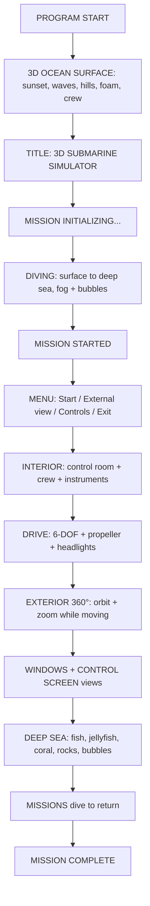

> Built by [Naima Sultana](https://github.com/naimasultana553-sys) | CSE Student, Bangladesh | [LinkedIn](https://www.linkedin.com/in/naima-sultana-76a678395)

# 🚢 3D Submarine Simulator — OpenGL / freeGLUT


A fully interactive **3D Submarine Simulator** written in **a single C++ file** with
**OpenGL + freeGLUT** (no Unity, no Unreal, no engine). You start on the ocean
surface at sunset, dive through a cinematic surface → deep-sea transition, then
operate a military-style submarine from the **control room** or a **360° exterior
orbit camera**.

Built for a Computer Graphics course: every object is an OpenGL primitive +
`glTranslate / glRotate / glScale`, lit with ambient / diffuse / specular /
spotlights, fogged with depth, and animated in the render loop.

---

## 📸 Screenshots

> The repo ships code-only. Run it and drop your captures here:

| Scene | Screenshot |
|---|---|
| Surface intro (sunset + foam + crew) | `docs/intro.png` — _add yours_ |
| Exterior 360° view underwater | `docs/exterior.png` — _add yours_ |
| Interior control room + crew | `docs/interior.png` — _add yours_ |
| Headlights illuminating reef | `docs/headlights.png` — _add yours_ |

To add one: take a screenshot while running → save it under `docs/` →
reference it in the table above.

---

## 🎬 Experience flow



---

## ✨ Features (mapped to the design spec)

### 1. Opening / intro scene
Sunset sky (warm west, blue east), low sun with glow + glitter path on water,
drifting clouds, sine-wave ocean surface, distant coastline hills, trees, floating
foam collar + bow breaker around the hull, black crew silhouettes on deck and
sail, slow cinematic push-in camera, `3D SUBMARINE SIMULATOR` →
`MISSION INITIALIZING...` overlay.

### 2. Diving animation
~5 s blend: sky fades, exponential fog ramps in, sunlight cools to deep blue,
bubbles spawn around the hull, marine life + seabed fade in, then
`MISSION STARTED` → menu.

### 3. Menu
`START MISSION` · `EXTERNAL 3D VIEW` · `CONTROLS` · `EXIT`
(navigate `Up/Down`, select `Enter`). `Enter` during the intro skips it.

### 4. Full external 3D view ⭐
Orbit camera locked on the hull: front / back / left / right / top / bottom /
diagonal, full 360°. Drag to orbit, wheel to zoom. The boat keeps sailing while
you inspect it — propeller spin, yaw, pitch and roll are all visible.

### 5. Exterior underwater world
Fish + schools, jellyfish with pulsing bells, seaweed swaying, corals (branch /
fan / brain), rocks, sand floor with dunes, rising bubbles, drifting particles,
headlight cone lighting the water ahead.

### 6–7. Interior + crew
Control-room shell (floor, ceiling, walls, front console with glowing screen +
colored buttons, side panels with animated gauge needles, ceiling pipes, seats,
portholes) plus **4 crew members** with head-bob and working arm animation.

### 8. Controls — full 6-DOF

| Key | Action |
|---|---|
| `W` / `S` | Throttle forward / reverse |
| `A` / `D` | Yaw (turn) |
| `R` / `F` | Pitch up / down (±45°) |
| `Q` / `E` | Roll (±30°) |
| `Arrow Up/Down` | Throttle · `Left/Right` turn |
| `L` | Headlights on/off |
| `C` | Cycle all 7 cameras |
| `V` / `I` | Jump to exterior / interior |
| `Space` | Emergency stop |
| `ESC` | Back to menu |
| Mouse drag / wheel | Orbit / zoom (exterior), look (free cam) |

### 9–10. Cameras & windows

| # | Mode | What you see |
|---|---|---|
| 1 | External 3D | Whole boat, 360° orbit + zoom |
| 2 | Interior | Consoles, crew, gauges, portholes |
| 3 | Front window | Water rushing past the bow |
| 4–5 | Left / right window | Reef passing abeam |
| 6 | Control screen | Long-range forward periscope feel |
| 7 | Free | Park anywhere, look around |

### 11–12. Deep sea + bubbles
80× swaying seaweed, 40× rocks, 30× corals, 100× drifting motes, 60× fish /
jellyfish with tail-wag + avoidance steering near the hull. Two bubble systems:
engine bubbles while moving + ambient seep bubbles, all wobbling upward.

### 13–15. Lights
Day: warm low sun (front-left-top so the camera side is lit) + strong ambient.
Deep: ambient collapses, blue exponential fog closes in, hull-follow fill light,
and a `GL_LIGHT2` **spotlight** for the twin bow searchlights with a translucent
cone mesh. Nearby reef pops bright; distance dissolves into dark.

### 16. 3D transforms in action
- **Translate** — boat, fish, bubbles, particles, camera dolly
- **Rotate** — yaw/pitch/roll, propeller, tails, needles, crew arms, orbit cam
- **Scale** — hull segments, fish sizes, corals, rocks, foam blobs
- Hull, sail, masts, fins and screw are nested `glPushMatrix` hierarchies.

### 17. Propeller
7-blade skewed bronze screw + hub spike + shaft. Spin rate ∝ throttle, stops at
rest.

### 18–20. Life, missions, obstacles

| Mission | Trigger |
|---|---|
| 1 Dive | Start submerged |
| 2 Explore | Depth > 5 m |
| 3 Navigate | Depth > 15 m |
| 4 Observe | Travel > 10 m from origin |
| 5 Return | Rise above 5 m after observing |

Rocks / coral heads / plant thickets are obstacles — steer around them; fish
actively avoid the hull.

### 21. HUD
Depth (m) · speed (knots) · `LIGHT ON/OFF` · `ENGINE ACTIVE/IDLE` · camera name ·
mission name · mission timer · mini control card. Cyan-on-translucent panels stay
readable in bright and dark water.

---

## 🛠️ The boat (what each part is made of)

| Part | Primitive idea |
|---|---|
| Pressure hull | Cylinder + sphere bow + tapered stern cone |
| Panel lines | Thin torus rings |
| Deck, limber holes, keel | Scaled cubes |
| Sail + swept leading edge | Boxes, rotated wedge |
| Periscope / snorkel / comms / radar / whip | Cylinders + spheres |
| Bow + sail planes, cruciform rudder | Scaled cubes |
| Searchlights | Cylinder housings + disk lenses + glow spheres |
| Screw | Sphere hub + 7 rotated/scaled cube blades |

---

## 🚀 Run it

### Option A — Code::Blocks (recommended, Windows)
1. Install Code::Blocks + MinGW and **freeGLUT**
   (headers → `MinGW\include\GL`, link `freeglut`, copy `freeglut.dll`
   next to the built `.exe`).
2. Open `submarine.cbp` → **Build → Build and Run**.
3. Linked libs are already set: `opengl32 glu32 freeglut gdi32 winmm`.

### Option B — command line (MinGW)
```bat
g++ submarine.cpp -o submarine.exe -lopengl32 -lglu32 -lfreeglut -lgdi32 -lwinmm
submarine.exe
```

---

## 📁 Project layout

```text
3D Submarine Simulator/
├── submarine.cpp   # entire simulator (~2300 lines)
├── submarine.cbp   # Code::Blocks project (Debug + Release)
├── README.md       # this file
├── .gitignore      # obj/, bin/, *.exe
└── docs/           # put your screenshots here
```

---

## 🎓 Good for your report / viva
Perspective projection · model-view transforms · depth testing · smooth shading ·
material specular · fog · alpha blending · display loop animation · keyboard /
mouse / timer callbacks — each maps to a visible feature above, so examiners can
*see* every concept working.

## 🗺️ Roadmap ideas
Collision warning text · sonar minimap · treasure/ring checkpoints · engine audio
· day/night toggle · recorded demo path.

## 📄 License
MIT — free for coursework, portfolios and remixes.

